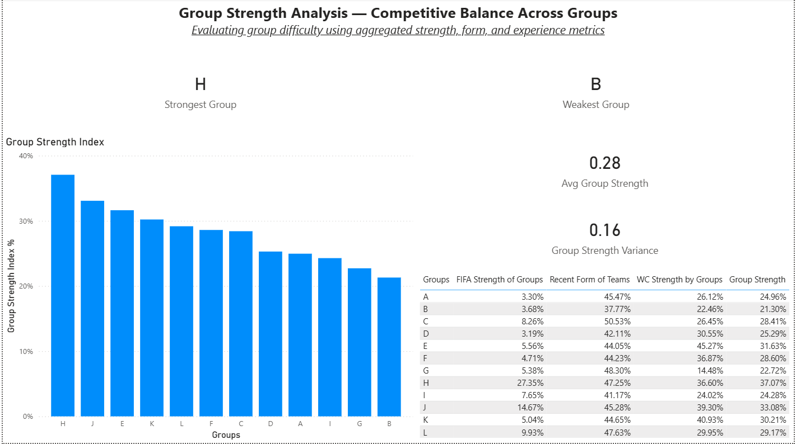
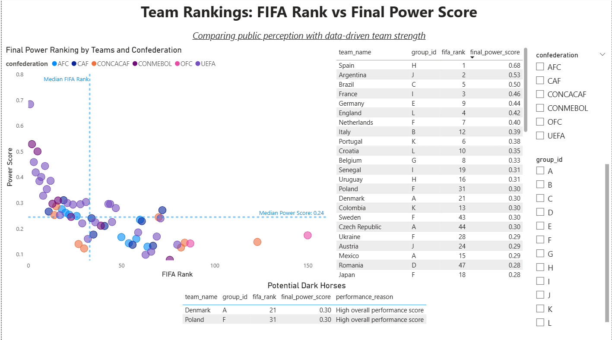
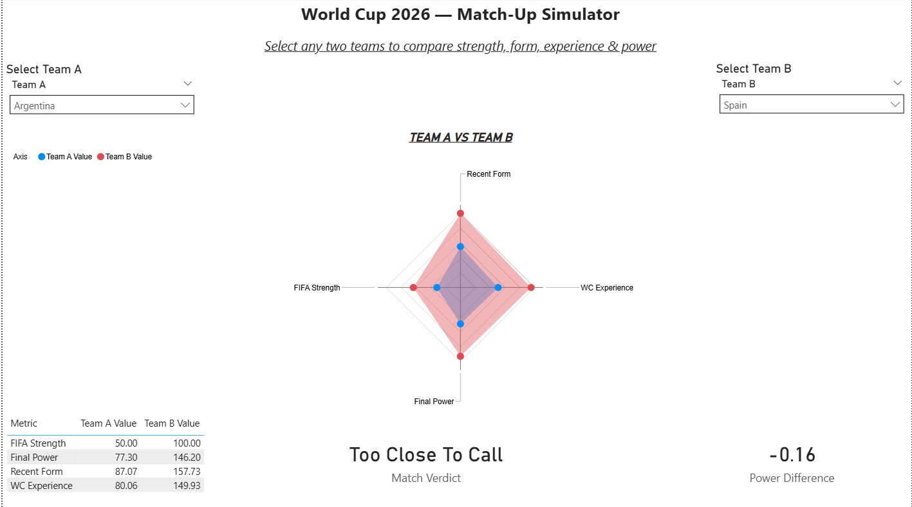

# 🌍 FIFA World Cup 2026 — Power Analysis & Match-Up Simulator

A full-stack analytics project combining data engineering, advanced metrics, and interactive visualization to evaluate team strength for the FIFA World Cup 2026.

This project goes beyond rankings to answer one core question:

> **Who is actually strong — and who is just perceived to be strong?**

Built using **Databricks SQL + Power BI**, this project delivers group insights, dark horse detection, and a head-to-head match-up simulator.

---

## 🚀 Project Highlights

- End-to-end **Bronze → Silver → Gold** data modeling
- Composite **Final Power Score** built from multiple performance dimensions
- **Group Strength Index** to evaluate group competitiveness
- **Dark Horse Detection** using rank vs performance divergence
- Interactive **Match-Up Simulator** with radar comparison
- Recruiter-ready, consulting-style dashboard design

---

## 🧠 Key Questions Answered

- Which groups are objectively strongest and weakest?
- Which teams are overrated vs underrated?
- Who are the true dark horses for WC 2026?
- How do two teams compare across strength, form, experience, and power?
- How competitive is the tournament overall?

---

## 🏗️ Architecture & Data Flow

Raw FIFA & Match Data
↓
Databricks SQL (Bronze)
↓
Cleaned & Enriched Tables (Silver)
↓
Analytical Models & Metrics (Gold)
↓
Power BI Dashboards & Simulator

---

### Gold-Layer Tables
- `gold_wc2026_team_master`
- `gold_final_power_score`
- `gold_group_strength_index`
- `gold_dark_horse_teams`

---

## 📊 Core Metrics

### 🔹 Final Power Score
A composite index built from:
- FIFA Strength
- Recent Form
- World Cup Experience
- Group Difficulty Adjustment

This represents **true team strength** beyond rankings.

---

### 🔹 Group Strength Index
Measures group competitiveness using:
- Average team power
- Strength dispersion
- Presence of elite teams

Used to identify **groups of death**.

---

### 🔹 Dark Horse Score
Identifies teams with:
- Lower FIFA ranking
- High Final Power Score

These teams are most likely to outperform expectations.

---

## 🖥️ Dashboard Pages

### Page 1 — Tournament Overview

- Total teams & groups
- Team strength ranking
- Confederation distribution

---

### Page 2 — Group Strength Analysis

- Group Strength Index comparison
- Strongest vs weakest groups
- Competitive balance insights

---

### Page 3 — Power vs Perception

- FIFA Rank vs Final Power scatter
- Dark horse identification
- Underrated teams table

---

### Page 4 — Match-Up Simulator

- Team selectors
- Radar chart comparison
- Power difference calculation
- Automated match verdict

---

## 🎮 Match-Up Simulator

Compare any two teams across:
- FIFA Strength
- Recent Form
- World Cup Experience
- Final Power (normalized)

Outputs:
- Radar comparison
- Power delta
- Match verdict:
  - Clear Favorite
  - Slight Edge
  - Too Close to Call

---

## 🛠️ Tools & Tech Stack

- **Databricks SQL** — data modeling & analytics
- **Power BI** — dashboards & interaction
- **DAX** — advanced measures & normalization
- **GitHub** — version control & portfolio hosting

---

## 📂 Repository Structure

📦 FIFA-World-Cup-2026-Analytics
┣ 📂 databricks-sql
┣ 📂 powerbi
┣ 📂 screenshots
┗ README.md

---

## 🎯 Why This Project Stands Out

- Real-world analytics framing
- Strong metric design
- Clear storytelling through visuals
- End-to-end ownership (data → insight → decision)
- Interview-ready explanations

---

## 📌 Future Enhancements

- Monte Carlo tournament simulation
- Probabilistic match outcomes
- Live qualifier data refresh
- Player-level impact modeling

---

## 👤 Author

**Dhruv Sharma**  
Aspiring Data Analyst / Analytics Engineer  

Focused on real-world, decision-driven analytics projects.
